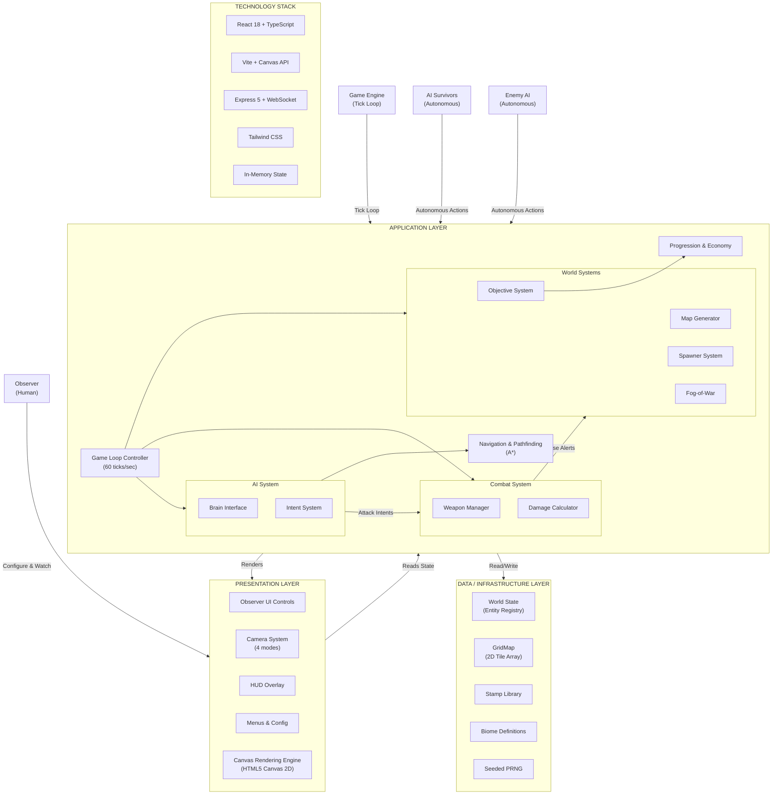

```mermaid
graph TD
    %% Primary Actors
    OBS["Observer\n(Human)"]
    GE["Game Engine\n(Tick Loop)"]
    AIS["AI Survivors\n(Autonomous)"]
    EAI["Enemy AI\n(Autonomous)"]

    %% Presentation Layer
    subgraph PL["PRESENTATION LAYER"]
        UI["Observer UI Controls"]
        CAM["Camera System\n(4 modes)"]
        HUD["HUD Overlay"]
        MENU["Menus & Config"]
        CANVAS["Canvas Rendering Engine\n(HTML5 Canvas 2D)"]
    end

    %% Application Layer
    subgraph AL["APPLICATION LAYER"]
        GLC["Game Loop Controller\n(60 ticks/sec)"]
        subgraph AISYS["AI System"]
            BRAIN["Brain Interface"]
            INTENT["Intent System"]
        end
        subgraph COMBAT["Combat System"]
            WEAPON["Weapon Manager"]
            DAMAGE["Damage Calculator"]
        end
        subgraph WORLD["World Systems"]
            MAPGEN["Map Generator"]
            OBJ["Objective System"]
            SPAWN["Spawner System"]
            FOW["Fog-of-War"]
        end
        NAV["Navigation & Pathfinding\n(A*)"]
        PROG["Progression & Economy"]
    end

    %% Data Layer
    subgraph DL["DATA / INFRASTRUCTURE LAYER"]
        WS["World State\n(Entity Registry)"]
        GRID["GridMap\n(2D Tile Array)"]
        STAMP["Stamp Library"]
        BIOME["Biome Definitions"]
        PRNG["Seeded PRNG"]
    end

    %% Tech Stack
    subgraph TECH["TECHNOLOGY STACK"]
        T1["React 18 + TypeScript"]
        T2["Vite + Canvas API"]
        T3["Express 5 + WebSocket"]
        T4["Tailwind CSS"]
        T5["In-Memory State"]
    end

    %% Actor connections
    OBS -->|"Configure & Watch"| PL
    GE -->|"Tick Loop"| AL
    AIS -->|"Autonomous Actions"| AL
    EAI -->|"Autonomous Actions"| AL

    %% Layer connections
    PL -->|"Reads State"| AL
    AL -->|"Renders"| PL
    AL -->|"Read/Write"| DL

    %% Internal Application connections
    GLC --> AISYS
    GLC --> COMBAT
    GLC --> WORLD
    AISYS -->|"Attack Intents"| COMBAT
    COMBAT -->|"Noise Alerts"| WORLD
    AISYS --> NAV
    OBJ --> PROG
```
