# CS4800 Exercise 5 — UML Component Diagram (WSS2)

**CS 4800 — In-Class Exercise 5**: UML Component Diagram for WSS2 "A Forgotten Place".
Showing each module/component/package organized by Architecture Layer.

---

## UML Component Diagram — Mermaid

```mermaid
graph TD
  %% External Actors
  OBS([Observer])
  AIS([AI Survivors])
  EAI([Enemy AI])

  subgraph PL["«layer» PRESENTATION LAYER"]
    OUI["«component»\nObserverUIControls\n──────────────\n[provides] SpeedControl\n[provides] CameraControl\n[provides] StartStop\n[requires] GameLoopAPI"]
    CS["«component»\nCameraSystem\n──────────────\n[provides] ViewportAPI\n[requires] WorldStateAPI"]
    HUD["«component»\nHUDOverlay\n──────────────\n[provides] DisplayAPI\n[requires] ObjectiveAPI\n[requires] ProgressionAPI"]
    CRE["«component»\nCanvasRenderingEngine\n──────────────\n[provides] RenderAPI\n[requires] WorldStateAPI\n[requires] ViewportAPI"]
  end

  subgraph AL["«layer» APPLICATION LAYER"]
    GLC["«component»\nGameLoopController\n──────────────\n[provides] GameLoopAPI\n[provides] TickAPI\n[requires] AISystemAPI\n[requires] CombatAPI\n[requires] WorldSystemsAPI"]

    subgraph AISYS["«subsystem» AI System"]
      BI["«component»\nBrainInterface\n[provides] AISystemAPI"]
      SB["«component»\nSurvivorBrains (5)\n[requires] AISystemAPI"]
      EB["«component»\nEnemyBrains (4+)\n[requires] AISystemAPI"]
      IS["«component»\nIntentSystem\n[provides] IntentAPI"]
      RS["«component»\nRadioSystem\n[provides] RadioAPI"]
    end

    subgraph COMBAT["«subsystem» Combat System"]
      WM["«component»\nWeaponManager\n[provides] WeaponAPI"]
      ARM["«component»\nArmorSystem\n[provides] ArmorAPI"]
      COV["«component»\nCoverSystem\n[requires] GridMapAPI"]
      NS["«component»\nNoiseSystem\n[provides] NoiseAPI"]
      DC["«component»\nDamageCalculator\n[provides] CombatAPI"]
    end

    subgraph WS["«subsystem» World Systems"]
      MG["«component»\nMapGenerator\n[requires] PRNGAPI\n[requires] StampAPI"]
      SP["«component»\nSpawnerSystem\n[provides] WorldSystemsAPI"]
      OS["«component»\nObjectiveSystem\n[provides] ObjectiveAPI"]
      FW["«component»\nFog-of-War\n[requires] GridMapAPI"]
      RC["«component»\nRiftPortalController\n[requires] ObjectiveAPI"]
      LD["«component»\nLootDistribution\n[requires] WorldStateAPI"]
      DNC["«component»\nDayNightCycle"]
      FM["«component»\nFactionManager\n[provides] FactionAPI"]
    end

    NAV["«component»\nNavigation & Pathfinding\n──────────────\n[provides] NavigationAPI\n[requires] GridMapAPI"]
    PE["«component»\nProgression & Economy\n──────────────\n[provides] ProgressionAPI\n[requires] WorldStateAPI"]
  end

  subgraph DL["«layer» DATA / INFRASTRUCTURE LAYER"]
    WSTATE["«component»\nWorldState\n[provides] WorldStateAPI"]
    GRID["«component»\nGridMap\n[provides] GridMapAPI"]
    STAMP["«component»\nStampLibrary\n[provides] StampAPI"]
    BIOME["«component»\nBiomeDefinitions\n[provides] BiomeAPI"]
    PRNG["«component»\nSeededPRNG\n[provides] PRNGAPI"]
    ENT["«component»\nEntityHierarchy\n[provides] EntityAPI\nActor > Survivor\nActor > Zombie\nActor > EnemyHuman\nCorruptionNest\nRiftPortal / Item"]
  end

  %% Actor → Presentation
  OBS -->|uses| OUI
  OBS -->|uses| CS
  AIS -->|drives| GLC
  EAI -->|drives| GLC

  %% Presentation internal
  OUI -->|GameLoopAPI| GLC
  CS -->|ViewportAPI| CRE
  HUD -.->|ObjectiveAPI| OS
  HUD -.->|ProgressionAPI| PE
  CRE -.->|WorldStateAPI| WSTATE

  %% Game Loop → Subsystems
  GLC -->|TickAPI| BI
  GLC -->|TickAPI| DC
  GLC -->|TickAPI| SP

  %% AI System internal
  BI --> SB
  BI --> EB
  BI --> IS
  IS --> RS

  %% AI → other systems
  BI -->|NavigationAPI| NAV
  BI -->|CombatAPI| DC
  NS -->|NoiseAPI| BI

  %% Combat internal
  DC --> WM
  DC --> ARM
  DC --> COV
  WM -->|weapon fire| NS

  %% World Systems internal
  SP --> MG
  SP --> OS
  OS --> RC
  SP --> FW
  SP --> FM

  %% Application → Data
  NAV -.->|GridMapAPI| GRID
  COV -.->|GridMapAPI| GRID
  FW -.->|GridMapAPI| GRID
  MG -.->|PRNGAPI| PRNG
  MG -.->|StampAPI| STAMP
  GLC <-.->|WorldStateAPI| WSTATE
  PE -.->|WorldStateAPI| WSTATE
  LD -.->|WorldStateAPI| WSTATE
```

---

## Component Inventory by Layer

### Presentation Layer (4 components)
| Component | Provided Interfaces | Required Interfaces |
|---|---|---|
| ObserverUIControls | SpeedControl, CameraControl, StartStop | GameLoopAPI |
| CameraSystem | ViewportAPI | WorldStateAPI |
| HUDOverlay | DisplayAPI | ObjectiveAPI, ProgressionAPI |
| CanvasRenderingEngine | RenderAPI | WorldStateAPI, ViewportAPI |

### Application Layer — AI System subsystem (5 components)
| Component | Provided Interfaces | Required Interfaces |
|---|---|---|
| BrainInterface | AISystemAPI | NavigationAPI, CombatAPI |
| SurvivorBrains (5 types) | — | AISystemAPI |
| EnemyBrains (4+ types) | — | AISystemAPI |
| IntentSystem | IntentAPI | — |
| RadioSystem | RadioAPI | — |

### Application Layer — Combat System subsystem (5 components)
| Component | Provided Interfaces | Required Interfaces |
|---|---|---|
| WeaponManager | WeaponAPI | — |
| ArmorSystem | ArmorAPI | — |
| CoverSystem | — | GridMapAPI |
| NoiseSystem | NoiseAPI | — |
| DamageCalculator | CombatAPI | WeaponAPI, ArmorAPI |

### Application Layer — World Systems subsystem (8 components)
| Component | Provided Interfaces | Required Interfaces |
|---|---|---|
| MapGenerator | — | PRNGAPI, StampAPI, BiomeAPI |
| SpawnerSystem | WorldSystemsAPI | WorldStateAPI |
| ObjectiveSystem | ObjectiveAPI | WorldStateAPI |
| Fog-of-War | — | GridMapAPI |
| RiftPortalController | — | ObjectiveAPI |
| LootDistribution | — | WorldStateAPI |
| DayNightCycle | — | — |
| FactionManager | FactionAPI | — |

### Application Layer — Shared subsystems (2 components)
| Component | Provided Interfaces | Required Interfaces |
|---|---|---|
| Navigation & Pathfinding | NavigationAPI | GridMapAPI |
| Progression & Economy | ProgressionAPI | WorldStateAPI |

### Data / Infrastructure Layer (6 components)
| Component | Provided Interfaces | Notes |
|---|---|---|
| WorldState | WorldStateAPI | Entity registry, faction table, score |
| GridMap | GridMapAPI | 2D tile array, walkability, cover values |
| StampLibrary | StampAPI | 12-20 building templates |
| BiomeDefinitions | BiomeAPI | 6 biome types |
| SeededPRNG | PRNGAPI | Deterministic generation |
| EntityHierarchy | EntityAPI | Actor→Survivor/Zombie/EnemyHuman + CorruptionNest/RiftPortal/Item |

---

## Interface Definitions

| Interface | Provider | Consumers |
|---|---|---|
| GameLoopAPI | GameLoopController | ObserverUIControls |
| WorldStateAPI | WorldState | CanvasRenderingEngine, CameraSystem, SpawnerSystem, ObjectiveSystem, ProgressionEconomy, LootDistribution, GameLoopController |
| GridMapAPI | GridMap | Navigation, CoverSystem, Fog-of-War |
| AISystemAPI | BrainInterface | SurvivorBrains, EnemyBrains, GameLoopController |
| CombatAPI | DamageCalculator | BrainInterface, GameLoopController |
| ObjectiveAPI | ObjectiveSystem | HUDOverlay, RiftPortalController |
| ProgressionAPI | ProgressionEconomy | HUDOverlay |
| NavigationAPI | Navigation&Pathfinding | BrainInterface |
| PRNGAPI | SeededPRNG | MapGenerator |
| StampAPI | StampLibrary | MapGenerator |
| NoiseAPI | NoiseSystem | BrainInterface (alert trigger) |
| FactionAPI | FactionManager | BrainInterface, CombatSystem |

---

## External Actor Interactions

| Actor | Interacts With | Nature |
|---|---|---|
| Observer (Human) | ObserverUIControls, CameraSystem | Configure, watch — no direct game control |
| AI Survivors | GameLoopController → BrainInterface | Autonomous — Brain.decide() per tick |
| Enemy AI | GameLoopController → BrainInterface | Autonomous — same Brain interface |
| Game Engine (Tick Loop) | All subsystems | Orchestrates Sense→Decide→Act→Spawn→Cleanup |
