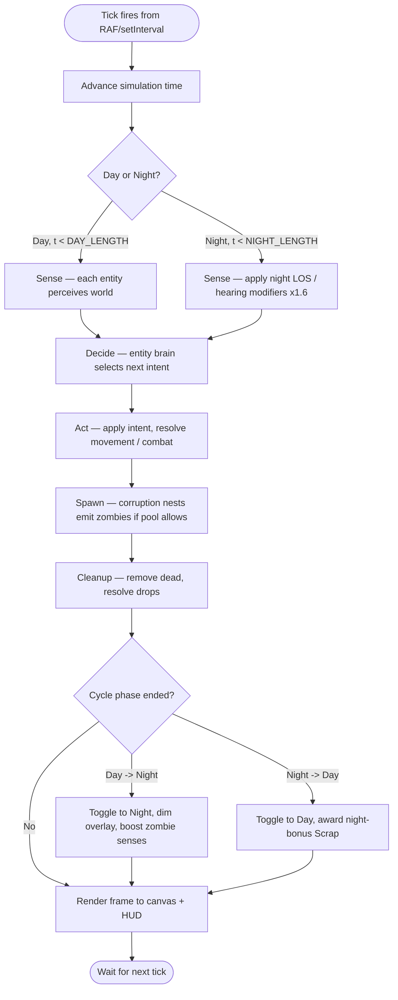
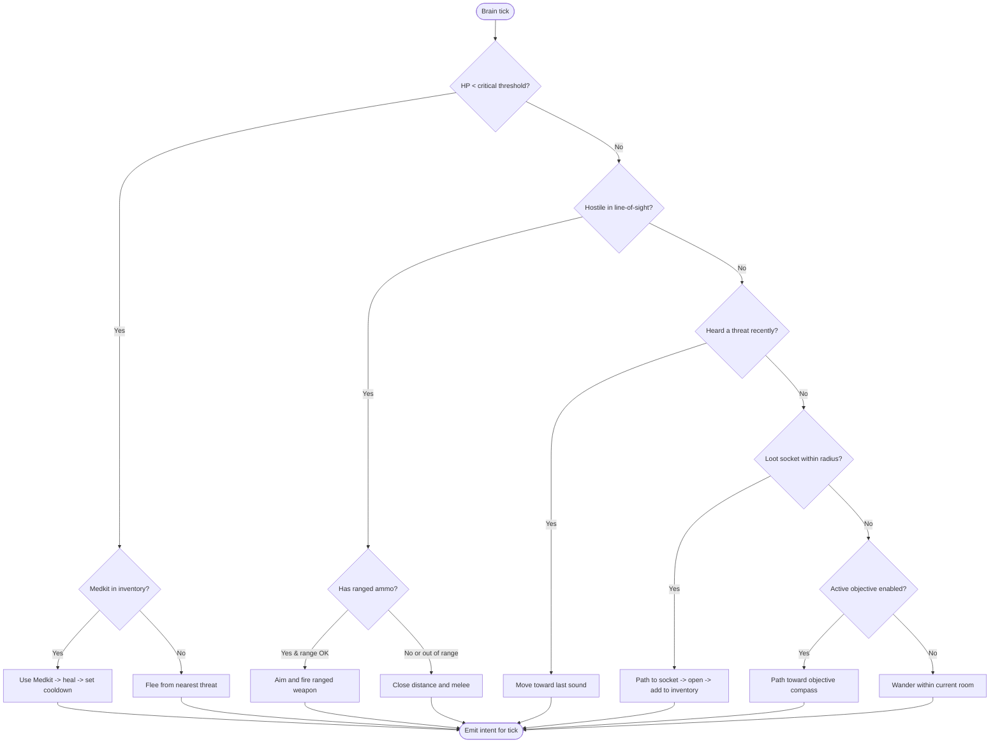
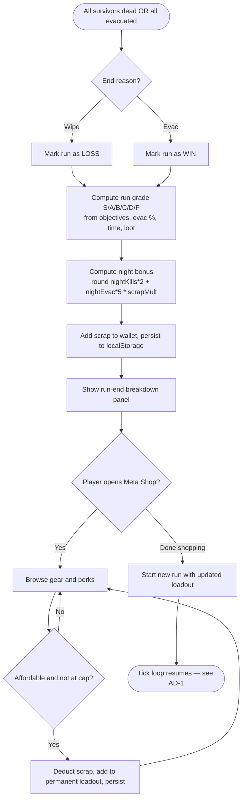

# Activity Diagrams — WSS2 *A Forgotten Place*

**Document type:** Functional Spec — Activity Diagrams (BA deliverable)
**Notation:** UML 2.5 Activity Diagrams expressed in Mermaid `flowchart` syntax (renders natively on GitHub and most Markdown previewers).

Three activity diagrams are provided, covering the three most behaviorally important flows in the simulation.

---

## AD-1 — Game Tick Loop (60 Hz)

The master tick loop runs at 60 ticks/sec and processes every entity through five ordered phases.

**Why this diagram matters:** the strict ordering Sense → Decide → Act → Spawn → Cleanup is the contract that lets the AI be deterministic across replays of the same seed. Any code that violates the order (e.g. an entity that moves during Sense) creates non-reproducible bugs.

---

## AD-2 — Survivor Decision Tick (per-survivor brain)

Each survivor runs this decision flow every tick (or every 5 ticks in low-CPU fallback).

**Implementation note:** this priority list is encoded as a 6-state machine in `src/combat/WSSPhase3.tsx`. The order is the priority order — earlier branches win. This is the documented "Survivor AI" slide in the deck (slide 5).

---

## AD-3 — Run End → Meta Shop → New Run

The full meta-loop: a run ends, score is computed, scrap is awarded, the player shops, then a new run begins.

**Spec-driven self-test:** the night-bonus formula `round((nightKills * 2 + nightEvac * 5) * scrapMult)` is asserted by an in-code self-test inside `computeNightBonus` at module load. Any drift between the displayed formula and the implementation throws immediately, before the player ever sees a wrong number.

---

*Source files referenced: `artifacts/a-forgotten-place/src/combat/WSSPhase3.tsx`, `artifacts/a-forgotten-place/src/combat/WSS2MetaShell.tsx`*
