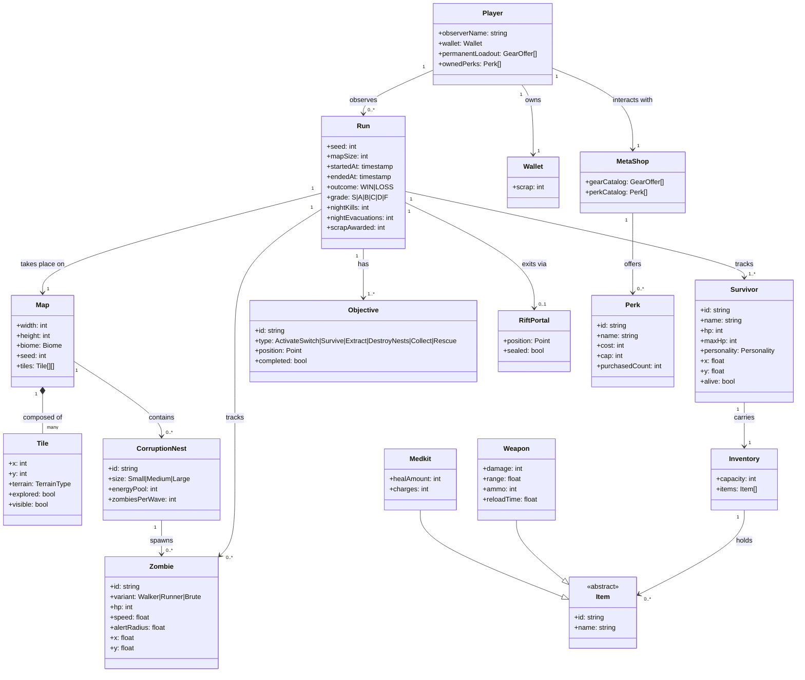
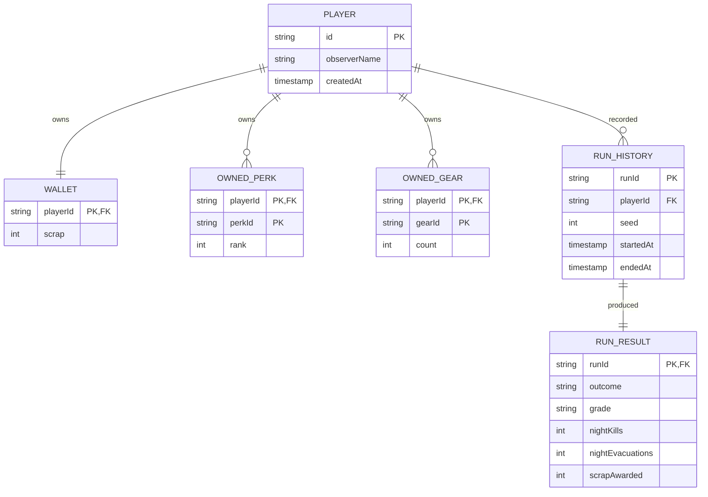

# Domain Object Model — WSS2 *A Forgotten Place*

**Document type:** Functional Spec — Domain Object Model (BA deliverable)
**Notation:** UML class diagram in Mermaid `classDiagram` syntax. Shows the *problem-domain* concepts and their relationships, independent of the React/TypeScript implementation. Cardinalities follow standard UML (`1`, `0..1`, `0..*`, `1..*`).

The class-implementation hierarchy (TypeScript types, React components) lives in the Technical/Design Spec → `03d-class-hierarchy.md`. This document is the *what*, not the *how*.

---

## Domain Class Diagram

---

## Key Domain Rules (encoded by the model)

1. **A Player observes many Runs but lives in only one persistent meta-state** — `Wallet`, `permanentLoadout`, and `ownedPerks` survive across runs (persisted to localStorage); everything inside a `Run` is ephemeral.
2. **Runs need at least one Survivor** (`1..*`) — a run with zero survivors is by definition over (LOSS).
3. **Runs need at least one Objective** — there's no such thing as a goalless run; even sandbox modes wrap in a `Survive(N ticks)` objective.
4. **A RiftPortal is optional on a Run** (`0..1`) — early tutorial maps and infinite survival modes don't have one.
5. **Zombies are owned by Runs, not by Nests** — a nest can be destroyed without despawning the zombies it already produced; this matches the gameplay rule "killing the nest stops the bleeding but doesn't clean up the spawn."
6. **Items are abstract** — `Weapon` and `Medkit` are the two concrete subtypes used in this submission; the class is abstract so future items (Grenade, Trap) slot in without schema changes.
7. **Perks are *capped*, not unlocked** — `purchasedCount <= cap`. Perks are stackable up to the cap (e.g. Iron Will rank 1, 2, 3) rather than boolean unlocks.

---

## ER Variant (for the data persistence layer)

If the domain model were translated to a relational schema for persistence (currently localStorage JSON, but hypothetically a SQL backend), the entity-relationship view would collapse value objects into columns and keep only the persistent entities:

The current implementation persists only the left half of this diagram (Player + Wallet + OwnedPerk + OwnedGear) to localStorage. `RUN_HISTORY` is in-memory only — surfacing it to a persistent store is on the post-class roadmap.
