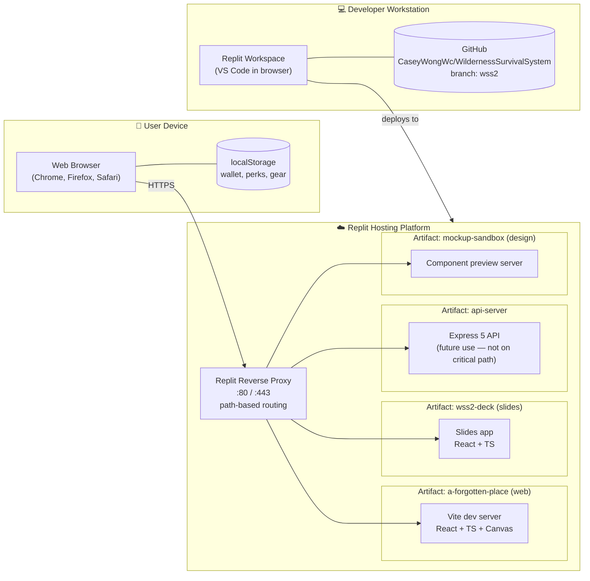

# Context (Deployment) Diagram — WSS2 *A Forgotten Place*

**Document type:** Technical Spec — Context / Deployment Diagram (DEV deliverable)
**Notation:** UML 2.5 Deployment Diagram expressed in Mermaid `flowchart` syntax with grouping nodes representing deployment containers (browser, server, hosting platform).

This diagram shows where each piece of the system *physically runs*, and how they communicate at the network boundary.

---

## C-1 — Deployment / Context Diagram

---

## What the diagram says, in plain English

- **The user runs nothing locally** beyond a standard web browser. There is no install step, no native runtime, no mobile app. The simulation, the renderer, and the AI all execute as JavaScript in the user's browser tab.
- **`localStorage` is the only persistence**. Wallet (scrap), purchased perks, and gear loadout are written to the browser's localStorage and read back on next visit. There is no server-side user account in this submission.
- **Replit hosts four separate artifacts** behind a single reverse proxy:
  - `a-forgotten-place` — the actual game (the only one needed to grade gameplay).
  - `wss2-deck` — the presentation slide deck.
  - `api-server` — an Express API stub, currently unused by the game; reserved for future leaderboards / cloud-save.
  - `mockup-sandbox` — an internal design tool (used during development for component previews; not user-facing).
- **The proxy routes by URL path**, so all four artifacts share `:80/:443` and are distinguished by their `/path` prefix. This is invisible to the user.
- **Git is the source of truth** for source code. CI/CD is implicit: deploying the Replit workspace re-runs the dev workflows that serve each artifact.

## Trust / Network Boundaries

| Boundary | What crosses it | Auth |
|---|---|---|
| Browser ↔ Replit Proxy | HTTPS, static asset fetch + websocket for HMR (dev) | None (public app) |
| Browser ↔ localStorage | Synchronous JS reads/writes | Same-origin policy |
| Workspace ↔ GitHub | Git push/pull over HTTPS | Personal access token |

## Why no backend in this submission

Originally the WSS2 plan included an Express + Postgres backend for persistent run history and global leaderboards. For the academic-deliverable scope, persistence was deliberately scoped down to localStorage so the grader can play the game with zero account creation. The `api-server` artifact remains in the monorepo as a forward-compatible stub — see `artifacts/api-server/` and the OpenAPI spec under `lib/api-spec/`.
