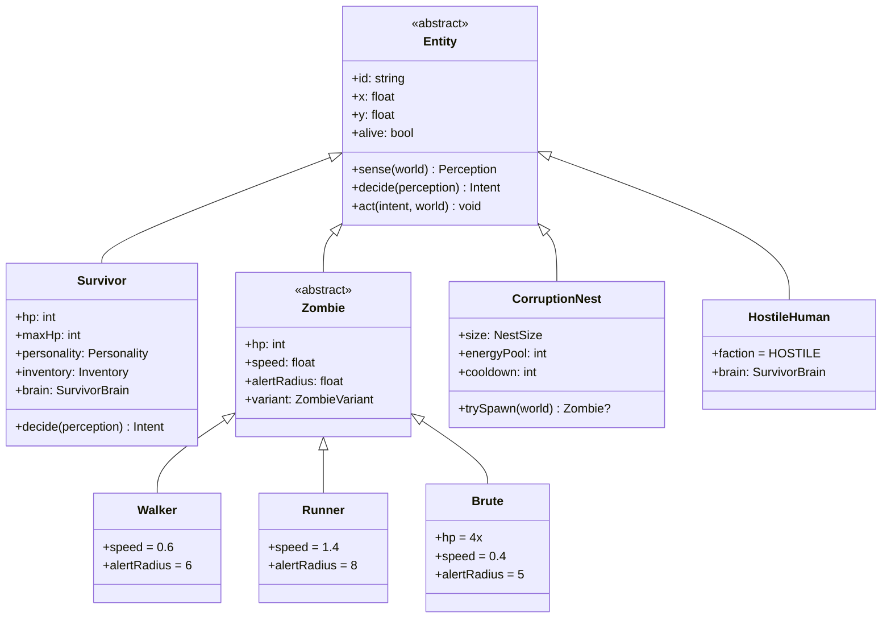
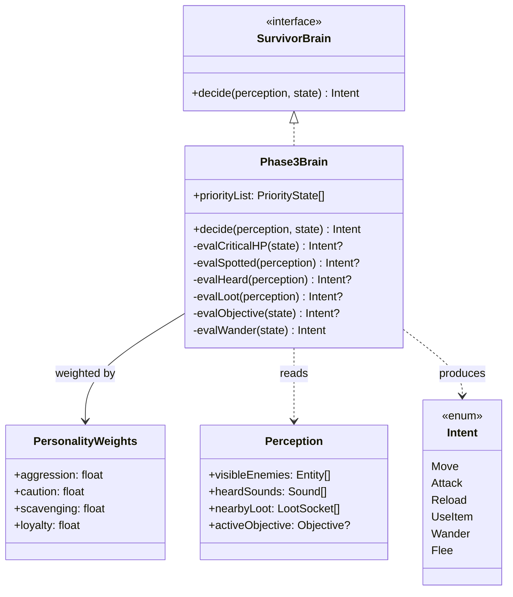
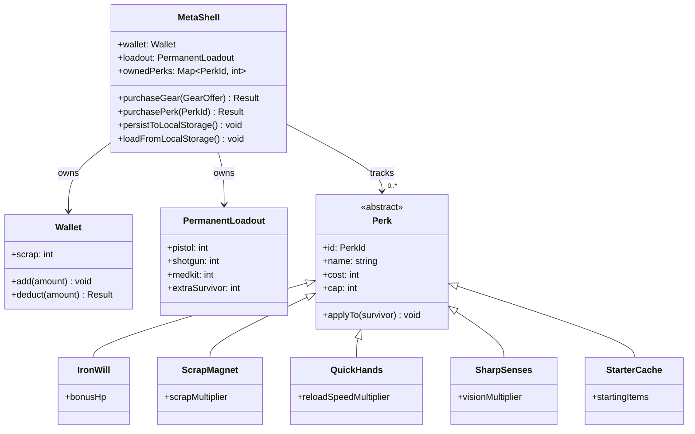

# Class Hierarchy & Relationships — WSS2 *A Forgotten Place*

**Document type:** Technical Spec — Class Hierarchy & Relationship Diagrams (DEV deliverable)
**Notation:** UML 2.5 Class Diagram in Mermaid `classDiagram` syntax. This is the *implementation-level* class diagram (how the TypeScript code is organized), as opposed to the conceptual Domain Object Model in `02-functional-requirements-spec/02c-domain-object-model.md` (what the *problem domain* looks like).

---

## CH-1 — Core simulation class hierarchy

**Note:** `HostileHuman` reuses `SurvivorBrain` intentionally — the AI for hostile humans is the same decision engine as for survivors, just with `faction = HOSTILE`. This is the canonical use case for the *Strategy Pattern* in this codebase (see `.local/tasks/strategy-pattern-future-phase.md`).

---

## CH-2 — Survivor AI brain hierarchy

---

## CH-3 — Meta-progression classes

---

## Design rationale (key relationships)

| Decision | Rationale |
|---|---|
| `Entity` is abstract with `sense → decide → act` contract | Forces every actor to fit the master tick-loop ordering; you cannot add an entity that bypasses the contract |
| `Zombie` is abstract; variants inherit | New zombie types (`Spitter`, `Screamer`) become a new subclass — open/closed principle |
| `SurvivorBrain` is an interface, not a base class | Lets the *brain* be swapped per-survivor (or eventually per-personality, or per-LLM) without touching `Survivor` |
| `Perk` is abstract with `applyTo(survivor)` | Each perk encapsulates its own effect; `MetaShell` doesn't know what any specific perk does |
| `MetaShell` is the only class that touches `localStorage` | Single chokepoint for persistence — everything else is in-memory and serializable |

---

*Source files: `artifacts/a-forgotten-place/src/combat/WSSPhase3.tsx` (Entity, Zombie, Survivor), `artifacts/a-forgotten-place/src/combat/WSS2MetaShell.tsx` (MetaShell, Wallet, Perks)*
