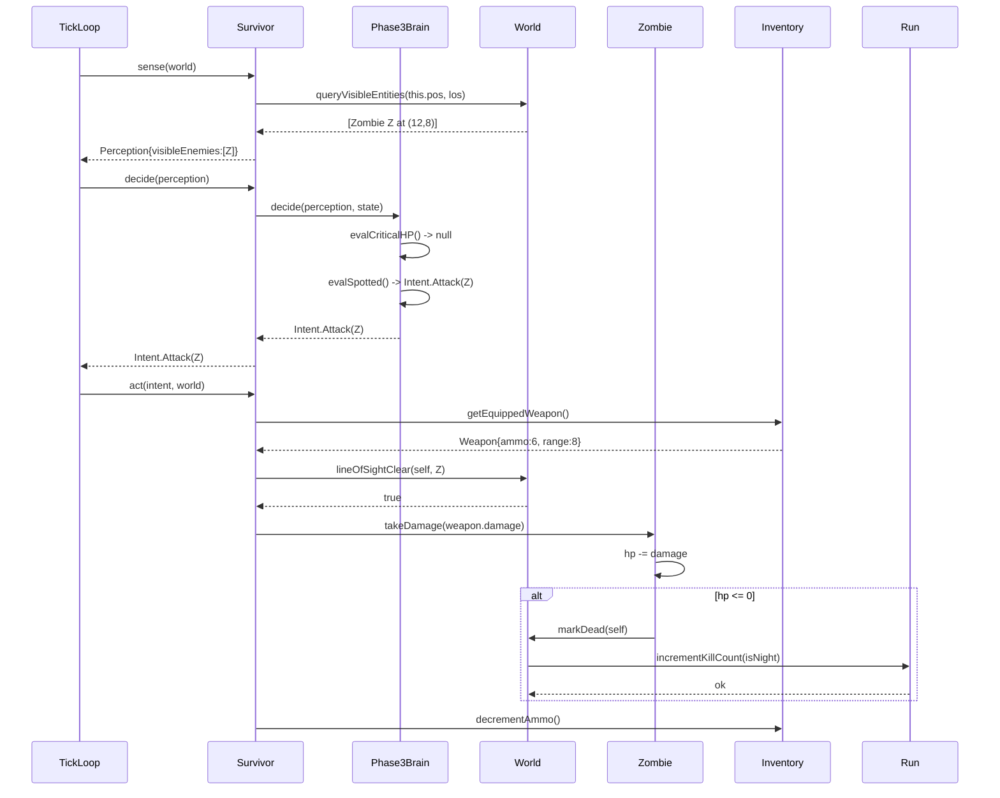
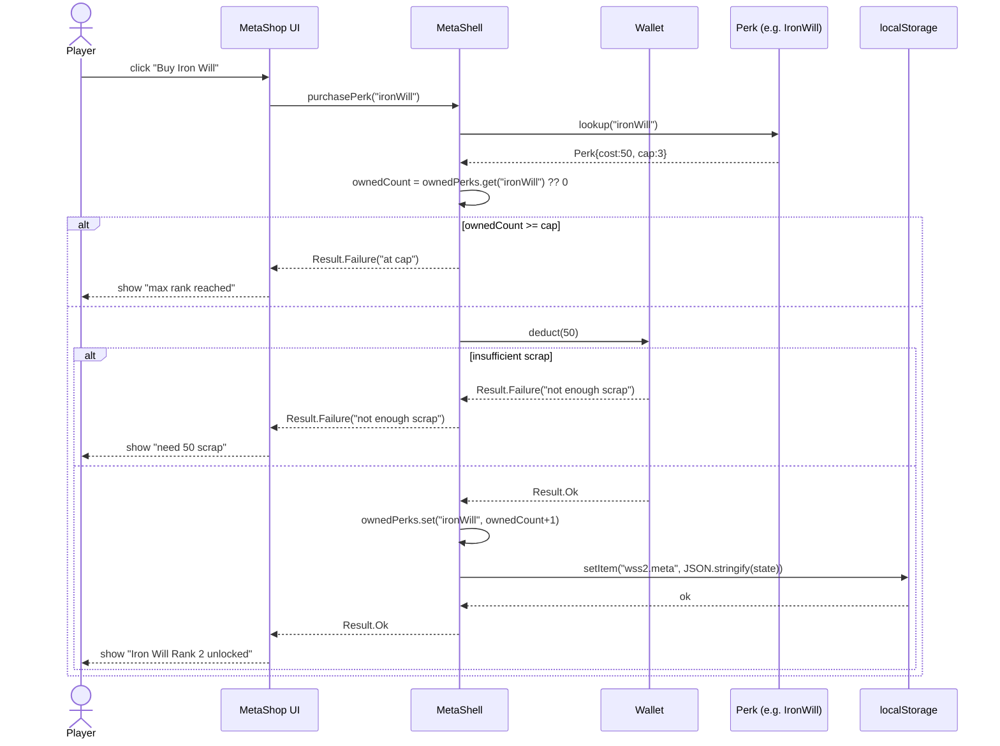

# Sequence Diagrams — WSS2 *A Forgotten Place*

**Document type:** Technical Spec — Sequence Diagrams (DEV deliverable)
**Notation:** UML 2.5 Sequence Diagrams in Mermaid `sequenceDiagram` syntax.

Three sequence diagrams cover the most behaviorally significant interactions in the system: a single tick of the simulation, a survivor combat encounter, and a meta-shop purchase.

---

## SD-1 — Single Simulation Tick

The master tick orchestrates every actor through Sense → Decide → Act in strict order.

```mermaid
sequenceDiagram
  participant Loop as TickLoop (60Hz)
  participant World as World
  participant S as Survivor
  participant Z as Zombie
  participant N as CorruptionNest
  participant HUD as HUD/Renderer

  Loop->>World: advanceTime(dt)
  World->>World: updateDayNightPhase()
  Loop->>S: sense(world)
  S-->>Loop: Perception{visibleEnemies, sounds, loot}
  Loop->>S: decide(perception)
  S-->>Loop: Intent{Move|Attack|Flee|...}
  Loop->>Z: sense(world)
  Z-->>Loop: Perception (with night LOS multiplier)
  Loop->>Z: decide(perception)
  Z-->>Loop: Intent
  Loop->>S: act(intent, world)
  S->>World: applyMovement / fireWeapon
  Loop->>Z: act(intent, world)
  Z->>World: applyMovement / meleeAttack
  Loop->>N: trySpawn(world)
  alt energy pool >= cost
    N->>World: spawn(Zombie)
  else not enough energy
    N-->>Loop: noop
  end
  Loop->>World: cleanup() — remove dead entities
  Loop->>HUD: render(world)
  HUD-->>Loop: frame painted
```

---

## SD-2 — Survivor Spots and Engages a Zombie

Walks through one of the most common in-run interactions: the AI sees a threat, decides to engage, fires, and resolves the kill.



---

## SD-3 — Meta Shop Purchase (Perk)

Walks through a player buying a perk between runs, including the persistence step.



---

## Why these three?

- **SD-1** is the *contract*. Every other behavior in the game ultimately runs through this loop. Understanding the order is necessary to understand any other diagram.
- **SD-2** is the *gameplay loop in microcosm*. Spotting → deciding → firing → kill resolution is the moment-to-moment experience of watching the AI play.
- **SD-3** is the *meta loop*. It crosses the only persistence boundary in the system (localStorage), and demonstrates the validation chain (cap check → scrap check → commit → persist).
